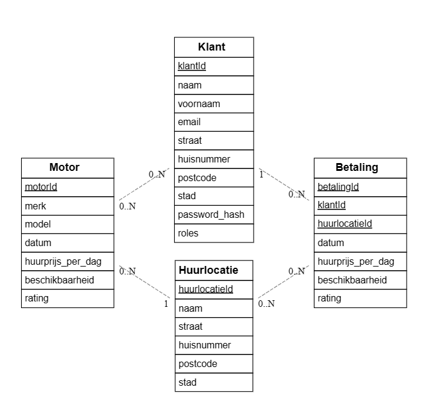
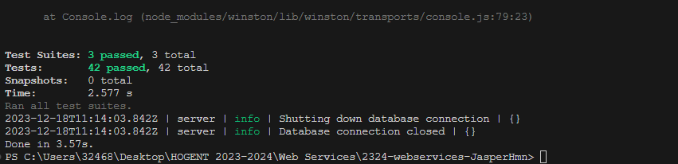
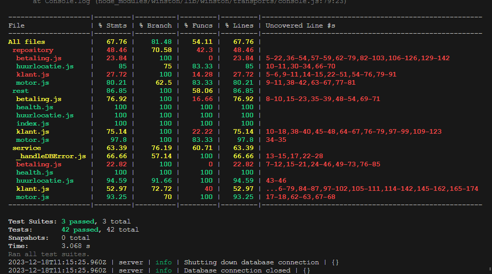

# Voornaam Familienaam (Studentennummer)

-   Student: Jasper Haegeman
-   Studentennummer: 202292134
-   E-mailadres: <mailto:jasper.haegeman@student.hogent.be>

-   [x] Front-end Web Development
    -   <https://github.com/Web-IV/2324-frontendweb-JasperHmn.git>
    -   <https://frontendweb-motor.onrender.com>
-   [x] Web Services:
    -   <https://github.com/Web-IV/2324-webservices-JasperHmn.git>
    -   <https://webservices-motor.onrender.com>

**Logingegevens**

**Admin**

-   Gebruikersnaam/e-mailadres: jasper.haegeman@student.hogent.be
-   Wachtwoord: 12345678

**Klant**

-   Gebruikersnaam/e-mailadres: jef.ds@hotmail.com
-   Wachtwoord: 12345678

## Projectbeschrijving

Dit is een motorverhuursite waarmee je eenvoudig motoren kunt huren. Als gast kun je alleen de motoren bekijken, maar na registratie en inloggen kun je als klant motoren reserveren voor een bepaald aantal dagen en de betaling regelen op een locatie naar keuze. Klanten kunnen ook hun betalingsgeschiedenis inzien. Beheerders hebben extra mogelijkheden, zoals het beheren van klantgegevens, locaties en motoren. Daarnaast kunnen zowel klanten als beheerders hun eigen gegevens aanpassen.

## Screenshots

## API calls

### Klanten

-   `GET /api/klanten`: alle gebruikers ophalen
-   `GET /api/klanten/:id`: gebruiker met een bepaald id ophalen
-   `POST /api/klanten/register`: gebruiker registeren
-   `POST /api/klanten/login`: gebruiker inloggen
-   `PUT /api/klanten/:id`: gebruiker met een bepaald id wijzigen
-   `DELETE /api/klanten/:id`: gebruiker met een bepaald id verwijderen

### Huurlocaties

-   `GET /api/huurlocaties`: alle huurlocaties ophalen
-   `GET /api/huurlocaties/:id`: huurlocatie met een bepaald id ophalen
-   `POST /api/huurlocaties`: huurlocatie toevoegen
-   `PUT /api/huurlocaties/:id`: huurlocatie met een bepaald id wijzigen
-   `DELETE /api/huurlocaties/:id`: huurlocatie met een bepaald id verwijderen

### Betalingen

-   `GET /api/betalingen`: alle betalingen ophalen
-   `GET /api/betalingen/:id`: betaling met een bepaald id ophalen
-   `POST /api/betalingen`: betaling toevoegen
-   `PUT /api/betalingen/:id`: betaling met een bepaald id wijzigen
-   `DELETE /api/betalingen/:id`: betaling met een bepaald id verwijderen

### Motoren

-   `GET /api/motoren`: alle motoren ophalen
-   `GET /api/motoren/:id`: motor met een bepaald id ophalen
-   `POST /api/motoren`: motor toevoegen
-   `PUT /api/motoren/:id`: motor met een bepaald id wijzigen
-   `DELETE /api/motoren/:id`: motor met een bepaald id verwijderen

## Behaalde minimumvereisten

### Front-end Web Development

-   **componenten**

    -   [x] heeft meerdere componenten - dom & slim (naast login/register)
    -   [x] applicatie is voldoende complex
    -   [x] definieert constanten (variabelen, functies en componenten) buiten de component
    -   [x] minstens één form met meerdere velden met validatie (naast login/register)
    -   [x] login systeem
             

-   **routing**

    -   [x] heeft minstens 2 pagina's (naast login/register)
    -   [x] routes worden afgeschermd met authenticatie en autorisatie
             

-   **state-management**

    -   [x] meerdere API calls (naast login/register)
    -   [x] degelijke foutmeldingen indien API-call faalt
    -   [x] gebruikt useState enkel voor lokale state
    -   [x] gebruikt gepast state management voor globale state - indien van toepassing
             

-   **hooks**

    -   [x] gebruikt de hooks op de juiste manier
             

-   **varia**

    -   [x] een aantal niet-triviale e2e testen
    -   [x] minstens één extra technologie
    -   [x] maakt gebruik van de laatste ES-features (async/await, object destructuring, spread operator...)
    -   [x] duidelijke en volledige README.md
    -   [x] volledig en tijdig ingediend dossier en voldoende commits

### Web Services

-   **datalaag**

    -   [x] voldoende complex (meer dan één tabel, 2 een-op-veel of veel-op-veel relaties)
    -   [x] één module beheert de connectie + connectie wordt gesloten bij sluiten server
    -   [x] heeft migraties - indien van toepassing
    -   [x] heeft seeds
             

-   **repositorylaag**

    -   [x] definieert één repository per entiteit (niet voor tussentabellen) - indien van toepassing
    -   [x] mapt OO-rijke data naar relationele tabellen en vice versa - indien van toepassing
             

-   **servicelaag met een zekere complexiteit**

    -   [x] bevat alle domeinlogica
    -   [x] bevat geen SQL-queries of databank-gerelateerde code
             

-   **REST-laag**

    -   [x] meerdere routes met invoervalidatie
    -   [x] degelijke foutboodschappen
    -   [x] volgt de conventies van een RESTful API
    -   [x] bevat geen domeinlogica
    -   [x] geen API calls voor entiteiten die geen zin hebben zonder hun ouder (bvb tussentabellen)
    -   [x] degelijke authorisatie/authenticatie op alle routes
             

-   **algemeen**

    -   [x] er is een minimum aan logging voorzien
    -   [x] een aantal niet-triviale integratietesten (min. 1 controller >=80% coverage)
    -   [x] minstens één extra technologie
    -   [x] maakt gebruik van de laatste ES-features (async/await, object destructuring, spread operator...)
    -   [x] duidelijke en volledige README.md
    -   [x] volledig en tijdig ingediend dossier en voldoende commits

## Projectstructuur

### Front-end Web Development

-   `2324-frontendweb-JasperHmn`
    -   `.vscode`
        -   `settings.json`
    -   `cypress`
        -   `e2e`
            -   `aboutus.cy.js`
            -   `customerpage.cy.js`
            -   `footer.cy.js`
            -   `homepage.cy.js`
            -   `locationpage.cy.js`
            -   `login.cy.js`
            -   `logout.cy.js`
            -   `payments.cy.js`
            -   `profilepage.cy.js`
            -   `register.cy.js`
            -   `rentalpage.cy.js`
        -   `fixtures`
            -   `example.json`
        -   `support`
            -   `commands.js`
            -   `e2e.js`
    -   `node_modules`
    -   `public`
        -   `vite.svg`
    -   `src`
        -   `api`
            -   `index.js`
        -   `assets`
            -   `foto's`
            -   `imageMap.js`
        -   `components`
            -   `banner`
                -   `customCarousel.jsx`
            -   `checkout`
                -   `CheckoutContainer.jsx`
                -   `CheckoutValidateForm.jsx`
                -   `FormField.jsx`
                -   `PaymentForm.jsx`
            -   `customer`
                -   `ConfirmationModal.jsx`
                -   `CustomersTable.jsx`
            -   `footer`
                -   `footer.jsx`
            -   `guestrentabike`
                -   `BikeSlide.jsx`
                -   `FlashBanner.jsx`
                -   `LoginRequiredModal.jsx`
            -   `loadingAndErrors`
                -   `AsyncData.jsx`
                -   `Error.jsx`
                -   `Forbidden.jsx`
                -   `Loading.jsx`
                -   `NotFound.jsx`
            -   `location`
                -   `CreateLocationModal.jsx`
                -   `DeleteLocationModal.jsx`
                -   `LocationTable.jsx`
            -   `login`
                -   `LoginForm.jsx`
                -   `LoginHeader.jsx`
            -   `motors`
                -   `CreateMotorForm.jsx`
                -   `Motor.jsx`
                -   `MotorList.jsx`
                -   `RatingStars.jsx`
            -   `navigation`
                -   `AuthControls.jsx`
                -   `Logo.jsx`
                -   `navbar.jsx`
                -   `NavLinks.jsx`
            -   `payments`
                -   `ConfirmationModal.jsx`
                -   `PaymentsTable.jsx`
            -   `profile`
                -   `ProfileForm.jsx`
                -   `ProfileHeader.jsx`
            -   `register`
                -   `formInput.jsx`
                -   `registerForm.jsx`
                -   `registerFormLayout.jsx`
                -   `registerValidateForm.jsx`
            -   `shop`
                -   `cart-item.jsx`
                -   `cart-summary.jsx`
                -   `confirmationpage.jsx`
                -   `product.jsx`
        -   `context`
            -   `auth-context.jsx`
            -   `shop-context.jsx`
        -   `pages`
            -   `aboutus.jsx`
            -   `cart.jsx`
            -   `checkout.jsx`
            -   `customers.jsx`
            -   `home.jsx`
            -   `locations.jsx`
            -   `login.jsx`
            -   `payments.jsx`
            -   `profile.jsx`
            -   `register.jsx`
            -   `rentabike.jsx`
            -   `shop.jsx`
        -   `main.jsx`
        -   `root.jsx`
        -   `theme.js`
    -   `.env`
    -   `.gitignore`
    -   `cypress.config.js`
    -   `dossier.md`
    -   `index.html`
    -   `package.json`
    -   `postcss.config.js`
    -   `README.md`
    -   `vite.config.js`
    -   `yarn.lock`

### Web Services

-   `2324-webservices-JasperHmn`
    -   `__tests__`
        -   `global.setup.js`
        -   `global.teardown.js`
        -   `supertest.setup.js`
        -   `common`
            -   `auth.js`
        -   `coverage`
        -   `rest`
            -   `health.spec.js`
            -   `huurlocaties.spec.js`
            -   `motoren.spec.js`
    -   `.vscode`
    -   `config`
    -   `coverage`
    -   `node_modules`
    -   `public`
        -   `images`
    -   `src`
        -   `core`
            -   `auth.js`
            -   `installMiddleware.js`
            -   `jwt.js`
            -   `logging.js`
            -   `password.js`
            -   `roles.js`
            -   `serviceError.js`
            -   `validation.js`
        -   `data`
            -   `migrations`
            -   `seeds`
            -   `index.js`
        -   `repository`
            -   `betaling.js`
            -   `huurlocatie.js`
            -   `klant.js`
            -   `motor.js`
        -   `rest`
            -   `betaling.js`
            -   `health.js`
            -   `huurlocatie.js`
            -   `index.js`
            -   `klant.js`
            -   `motor.js`
        -   `service`
            -   `_handleDBError.js`
            -   `betaling.js`
            -   `health.js`
            -   `huurlocatie.js`
            -   `klant.js`
            -   `motor.js`
        -   `createServer.js`
        -   `index.js`
        -   `testjwt.js`
        -   `testpw.js`
    -   `.env`
    -   `.env.test`
    -   `.gitignore`
    -   `jest.config.js`
    -   `package.json`
    -   `README.md`

## Extra technologie

### Front-end Web Development

Gebruik van Chakra UI. Het is een technologie die gebruikt maakt van een standaardlibrary om zo
op een gemakelijke manier een mooie UI te maken. Het is een open-source design systeem dat bestaat uit een componentenbibliotheek en een aantal tools die helpen bij het bouwen van toegankelijke React-applicaties.

https://www.npmjs.com/package/@chakra-ui/react

https://chakra-ui.com/

### Web Services

Gebruik van zxcvbn.
Het is een wachtwoordsterkte-inschattingstool die beordeelt wachtwoorden op basis van hun sterkte en geeft feedback over hoe ze kunnen worden verbeterd.

zxcvbn evalueert de sterkte van een wachtwoord op basis van verschillende criteria, waaronder lengte, complexiteit en het al dan niet gberuik van woordenboekwoorden.

`yarn add zxcvbn`

https://www.npmjs.com/package/zxcvbn

## Testresultaten

### Front-end Web Development

### aboutus.cy.js

De test controleert of de hoofdtitel en sectiekoppen correct worden weergegeven, of het aantal secties overeenkomt met de verwachtingen en kijkt ook of de achtergrondkleur overeenkomt.

### customerpage.cy.js

De test controleert na het inloggen en navigeren naar de klantenpagina of de tabel en juiste kolomheaders worden getoond.

### footer.cy.js

De test controleert of de footer op de homepagina correct wordt weergegeven en verifieert of de tekst, achtergrondkleur en randstijlen voldoen aan de opgegeven specificaties.

### homepage.cy.js

De test controleert voor alle drie de rollen (klant, admin en gast) of de CustomCarousel aanwezig is en of de juiste welkomstboodschap wordt weergegeven, afhankelijk van de rol van de gebruiker na inloggen.

### locationpage.cy.js

De test toont of een locatie succesvol kan worden aangemaakt en gecontroleerd. Na inloggen en navigeren naar de locatiepagina, wordt getest of de optie om een nieuwe locatie te creëren beschikbaar is en werkt. Vervolgens worden de details van een nieuwe locatie ingevoerd en opgeslagen. De test controleert of de nieuwe locatie correct wordt weergegeven in de tabel met de ingevoerde gegevens.

### login.cy.js

De test controleert of inloggen als gebruiker succesvol is en of de gebruiker de juiste welkomstboodschap op de homepage ziet. Een andere test controleert of inloggen als admin succesvol is en of de admin de specifieke welkomstboodschap en informatie op de homepage ontvangt.

### logout.cy.js

De test controleert of, na uitloggen, de gebruiker weer naar de inlogpagina wordt geleid en of de knop "Log in" zichtbaar is.

### payments.cy.js

De test controleert of de betalingspagina correct wordt weergegeven na inloggen, of de tabel met betalingsinformatie de juiste kolomkoppen toont en of het bevestigingsvenster verschijnt wanneer de delete-knop wordt ingedrukt. Ook wordt getest of een betaling daadwerkelijk wordt verwijderd na het bevestigen van de actie.

### profilepage.cy.js

De test controleert of de profielpagina correct wordt weergegeven na inloggen en of de gebruiker profielinformatie kan bewerken. Dit omvat het verifiëren van de initiële profielgegevens, het invoeren van gewijzigde gegevens in bewerkingsmodus en het klikken op de knop om de bijgewerkte informatie op te slaan.

### register.cy.js

De test controleert of een nieuwe gebruiker succesvol kan worden geregistreerd en of de gebruiker wordt doorgestuurd naar de inlogpagina na een succesvolle registratie. De test simuleert een registratieverzoek en verifieert de redirect naar de loginpagina.

### rentalpage.cy.js

De test controleert of de RentABike-pagina correct laadt, of de slider met motorfietsen zichtbaar is en of elke dia een flash-banner bevat. Ook wordt getest of het klikken op de 'Rent Now'-knop een modal opent met de boodschap "You need to be logged in to rent a bike".

### Web Services

#### huurlocaties

Deze test kijkt of de software de lijst van beschikbare huurlocaties correct weergeeft.
We controleren ook of de software goed omgaat met situaties waarin gebruikers verkeerde informatie invoeren.
We passen dit ook toe voor het toevoegen, bijwerken en verwijderen van een huurlocatie.

#### health

Deze test evalueert de gezondheids- en versie-eindpunten van de server om ervoor te zorgen dat ze correct reageren en de verwachte informatie verstrekken. Daarnaast wordt gecontroleerd of de server zich goed gedraagt bij het benaderen van een onbekende URL.

#### motoren

Deze test waarborgt de correcte werking van de API voor motorbeheer in verschillende scenario's, inclusief toevoegen, bijwerken en verwijderen van motoren. Ze dienen als waarborg voor een goede functionaliteit en beveiliging van de applicatie.

### Screenshots

## Gekende bugs

### Front-end Web Development

Geen gekende bugs binnen Front-end Web Development.

### Web Services

Geen gekende bugs binnen Web Services.

## Wat is er verbeterd/aangepast?

### Front-end Web Development

-   Ik heb de lay-out volledig vernieuwd en vanaf nul opnieuw opgebouwd. Ik heb gezorgd voor een gestructureerde opbouw en gebruik gemaakt van diverse componenten om de pagina’s te verkorten, overzichtelijker te maken en gemakkelijker aan te passen.

### Web Services

-   Ik heb enkele kleine aanpassingen aangebracht in de restlaag bij huurlocaties, zodat ik ze kan ophalen op naam via het id en de seed-data voor motoren aangepast en verminderd.
